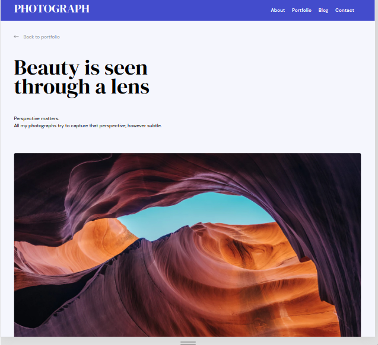

# Front-end final mockup-to-website project

<!-- TABLE OF CONTENTS -->

## Table of Contents

- [Overview](#overview)
  - [Built With](#built-with)
- [How to use](#how-to-use)
- [Contact](#contact)

<!-- OVERVIEW -->

## Overview



We can see my demo following those links :
<a href="https://front-end-finals.netlify.app/"> Memo</a>
some experience :

some experience :

- I built this project based on an existing project.

- What have I learned and improved
  When I built this project , I gained some knowledge. First, I have learned how to use image sliders , secondly , using sass with fonts.

Wisdom to share :

- To learn is to not be afraid of making mistakes. The more you make mistakes the more you learn.

## Built with

<!-- This section should list any major frameworks that you built your project using. Here are a few examples.-->

- [HTML](https://html.com/)
- [Sass](https://sass-lang.com/guide)

## How To Use

To clone and run this application, you'll need [Git](https://git-scm.com) and [Node-sass](https://docs.npmjs.com/cli/v6/commands/npm-install) (which comes with [npm](http://npmjs.com)) installed on your computer. From your command line:

```bash
# Clone this repository
$ git clone https://github.com/bakozetra/front-end-finals

# Install dependencies
$ npm install or yarn install

# Run the app
$ npm start or yarn start
```

## Contact

- GitHub [@Bakozetra](https://github.com/bakozetra)
